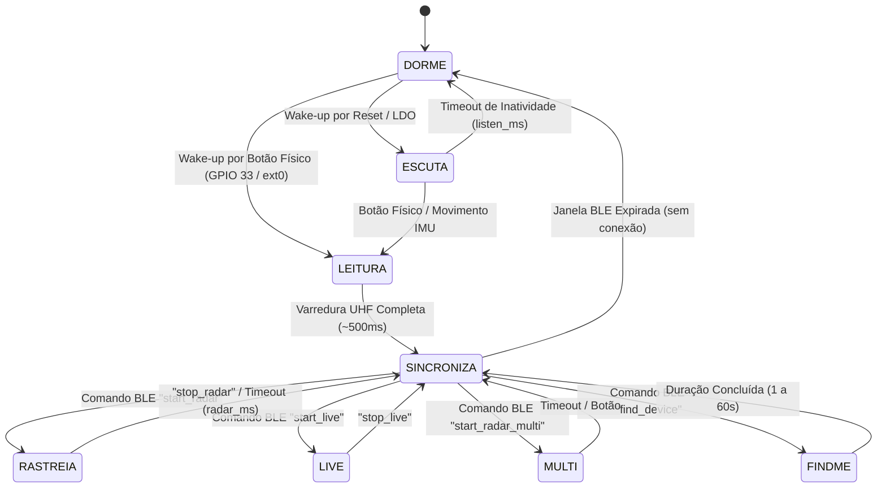

# 🧠 Guia do Firmware (ESP32 / ESP32-S3 + LittleFS)

O firmware do Trakr é o núcleo autônomo do **TRK-Finder** (rastreador portátil de ferramentas). Ele foi escrito em C++ moderno no ecossistema Arduino/ESP-IDF e gerenciado via **PlatformIO**.

---

## 🛠️ Ambiente de Desenvolvimento e Compilação

1. Instale o [VS Code](https://code.visualstudio.com/) e a extensão **PlatformIO IDE**.
2. Abra a pasta `firmware/` no VS Code. O PlatformIO fará o download automático da toolchain e dependências.

### Ambientes de Build (`platformio.ini`):
* `esp32radar`: Build padrão para ESP32-WROOM-32 com módulo YRM100 real via UART2.
* `esp32radar-sim`: Build de simulação com flag `-DTRAKR_SIM` para desenvolvimento do app sem o módulo UHF.
* `esp32s3radar`: Build para placas ESP32-S3 (USB nativo e maior performance).
* `esp32s3radar-sim`: Build de simulação para ESP32-S3.

---

## ⚙️ Máquina de Estados Finita (FSM)

O loop principal opera em uma máquina de estados não-bloqueante:

### Detalhamento dos Estados:
1. **`ESCUTA`:** Espera ativa (~30 s). O LED permanece em verde suave aguardando comando BLE ou acionamento de botão.
2. **`RASTREIA` (Modo Radar):** Varreduras em ciclos curtos (~400 ms) buscando uma tag alvo. Publica `radar_report` com **RSSI (dBm)**, delta de aproximação e hint direcional, modulando bipes e feedback visual.
3. **`LIVE` (Varredura ao Vivo):** Streaming contínuo de todas as tags UHF detectadas no alcance do leitor.
4. **`MULTI` (Radar Multi-Alvo):** Rastreia uma lista de tags simultaneamente, ordenando-as em tempo real por potência de sinal.
5. **`LEITURA`:** Disparada pelo botão físico. Executa a leitura de todas as ferramentas e publica o inventário via GATT.
6. **`SINCRONIZA`:** Mantém o link BLE ativo. Se o app estiver conectado, executa re-varreduras automáticas a cada 10 s para manter o inventário espelhado.
7. **`FINDME`:** Modo "Encontre meu Rastreador" — pulsa LED branco e buzzer em cadência de 2 Hz de forma não bloqueante para localização física do aparelho.
8. **`DORME` (Deep Sleep):** Desliga o módulo UHF (corte via `YRM100_EN_PIN`), desliga memórias RTC desnecessárias e coloca o ESP32 em sono profundo consumindo microamperes, despertando apenas via `ext0` no botão.

---

## 🧩 Bibliotecas e Módulos Internos (`lib/`)

* **`TrakYrm100`:** Driver de comunicação serial com o módulo UHF YRM100. Suporta coleta de EPCs em massa, extração de RSSI em dBm, controle dinâmico de potência TX (0 a 33 dBm) e gravação de novos EPCs (`writeEpc`).
* **`TrakBattery`:** Leitura real de tensão e porcentagem de bateria via sensor I2C **INA219** (endereço `0x40`) com fallback automático para divisor resistivo via ADC.
* **`TrakSensors`:** Monitoramento ambiental com sensor **BME280** (`0x76` - temperatura, umidade, pressão) e acelerômetro **MPU6050** (`0x68` - detecção de movimento e impacto).
* **`TrakOled`:** Display SSD1306 I2C (`0x3C`) com interface "Tactical HUD", retículo de mira, percentual de proximidade e indicação de status.
* **`TrakHaptics`:** Controle de buzzer passivo com modulação contínua de frequência (200 Hz a 2400 Hz) e acionamento de motor vibratório em aproximação crítica (`rssi > -45 dBm`).
* **`TrakEvents`:** Gerenciador do livro-razão de eventos offline persistido em Flash (`events.json`), com rotação automática mensal (`/events_YYYYMM.json`).
* **`TrakConfig`:** Armazenamento seguro de configurações, calibrações de RF e hash SHA-256 do PIN em `/config.json`.

---

## 🔄 Sistema de Atualização OTA e Segurança de Boot

O firmware conta com particionamento duplo OTA (`ota_4mb.csv` / `ota_8mb.csv`):
* Recebimento de chunks binários via característica GATT **Ota** (200 bytes sem resposta).
* **Healthcheck de Boot:** Ao reiniciar no novo firmware, o ESP32 roda em estado `PENDING_VERIFY`. Se o sistema permanecer saudável por 10 segundos sem travamento do Watchdog, a nova partição é validada permanentemente via `esp_ota_mark_app_valid_cancel_rollback()`. Caso ocorra falha de boot, o bootloader reverte automaticamente para a versão anterior.