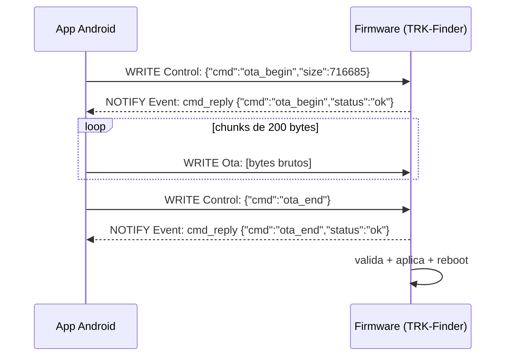
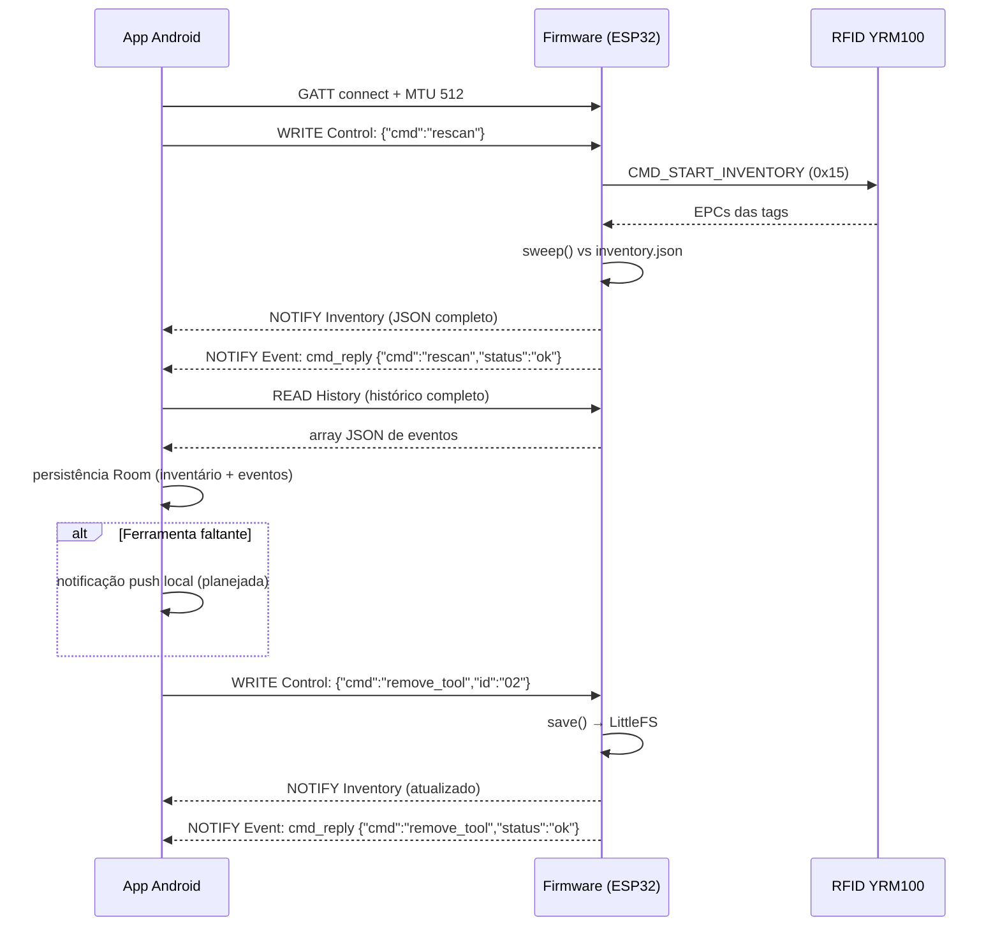
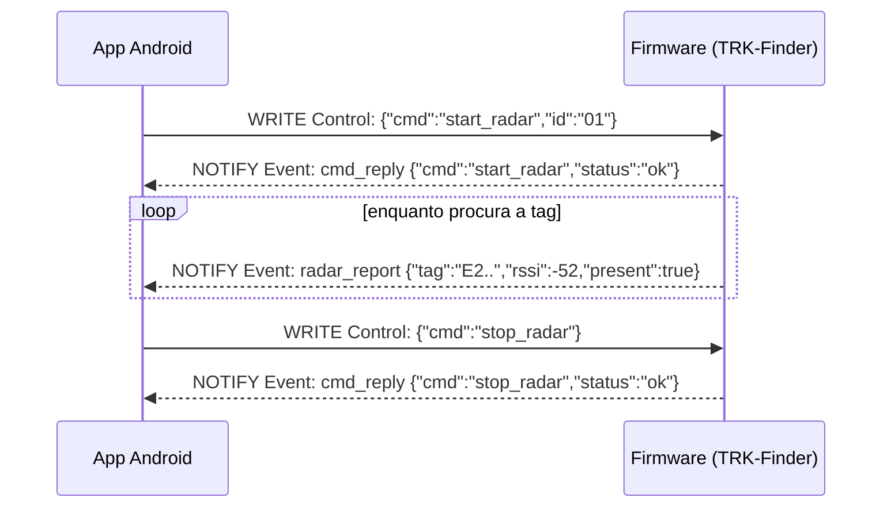

# 📡 Protocolo BLE / GATT do Trakr

Este documento é a **fonte da verdade** do protocolo de comunicação entre o **TRK-Finder** (firmware ESP32) e o app Android. Todo código deve seguir este documento:

* Firmware: `firmware/include/ble_profile.h`
* App: `app/src/main/kotlin/app/trakr/core/ble/BleProfile.kt`

> ⚠️ Se alterar qualquer UUID ou formato de payload, **atualize os três** (este documento, `ble_profile.h` e `BleProfile.kt`) no mesmo commit.

## Dispositivo

| Propriedade | Valor |
| --- | --- |
| Nome (advertisement) | `TRK-FINDER` |
| Filtro de scan do app | prefixo `TRK-` |
| MTU | 512 bytes (negociado) |
| Intervalo de conexão | 24–48 slots (60s supervisor) |

> O app conecta-se a todos os rastreadores TRK-Finder encontrados (multi-device).

## Serviço

| Campo | Valor |
| --- | --- |
| UUID do serviço | `60c1f000-1b2e-4d0f-9aeb-0fbe3c2a4b71` |

## Características

| UUID | Nome | Propriedades | Descrição |
| --- | --- | --- | --- |
| `60c1f001-...` | **Inventory** | READ + NOTIFY | Inventário em JSON (formato idêntico ao `inventory.json`). |
| `60c1f002-...` | **Event** | READ + NOTIFY | Último evento assíncrono em JSON. |
| `60c1f003-...` | **Control** | WRITE | Comandos do app para o firmware (JSON). |
| `60c1f004-...` | **History** | READ | Histórico completo de eventos (array JSON, máx. 100). |
| `60c1f005-...` | **Ota** | WRITE | Stream binário bruto do firmware (chunks de até 200 bytes, sem resposta). |

> **Fluxo de sincronização:** no `onServicesDiscovered`, o app assina *Inventory*/"Event", lê *History* e envia `{"cmd":"rescan"}`; o firmware responde notificando o inventário completo.

## Payloads

### Inventário (notify/read)

```json
{
  "tools": [
    { "id": "01", "name": "Chave de Fenda Cross", "tag": "E28011606000020400000001", "present": true }
  ]
}
```

> O arquivo no LittleFS é `inventory.json`.

### Historico (read — History)

```json
[
  { "ts": 1723780800000, "type": "boot", "tool_id": "", "name": "" }
]
```

* `ts`: timestamp do evento em milissegundos. Se o relógio foi sincronizado via `set_clock`, é o epoch UTC absoluto (`uint64_t`); caso contrário, é o `millis()` relativo ao boot.
* Tipos: `boot`. Os relatórios efêmeros (`radar_report`, `cmd_reply`) **não** são persistidos no histórico.

### Relatório do modo radar (notify)

Publicado continuamente enquanto o rastreador procura a tag alvo. **Não é
persistido no histórico** (`events.json`) — o app apenas atualiza a tela de
localização.

```json
{ "type": "radar_report", "tag": "E28011606000020400000001", "rssi": -52, "present": true }
```

* `rssi`: potência do sinal da tag em dBm (negativo; mais perto = mais forte).
* `present`: `true` se a tag alvo foi lida na última varredura; `false` (com
  `rssi: -100`) quando ainda não há sinal.
* O firmware também guia por bipes: intervalo do bip proporcional à potência
  (1000 ms sem sinal → 100 ms com sinal forte, estilo "detector de metais").

### Comandos do app (control — WRITE)

| Comando | Payload | Efeito no firmware |
| --- | --- | --- |
| Varrer novamente | `{"cmd":"rescan"}` | Executa `LEITURA` (sweep UHF + publish). |
| Ler configuração | `{"cmd":"get_config"}` | Retorna `listen_ms/radar_ms/beep/has_pin/authed` via `cmd_reply`. |
| Alterar configuração | `{"cmd":"set_config","listen_ms":30000,"radar_ms":120000,"beep":true}` | Campos parciais; `pin` define troca de PIN (requer auth se PIN já existe). |
| Autenticar PIN | `{"cmd":"auth","pin":"1234"}` | Verifica SHA-256; abre sessão de 5 min para `add_tool`/`remove_tool`. |
| Ler histórico | `{"cmd":"get_history"}` ou `{"cmd":"get_history","month":"202508"}` | Retorna `history` (array) do mês solicitado ou recente (200) se sem mês. |
| Listar arquivos de histórico | `{"cmd":"list_archives"}` | Retorna `archives` com `{month,count,path}` por mês arquivado. |
| Adicionar ferramenta | `{"cmd":"add_tool","name":"...","tag":"E2..."}` | Adiciona ao inventário e salva em LittleFS; re-notifica inventário. **Requer auth se PIN ativo**. |
| Remover ferramenta | `{"cmd":"remove_tool","id":"01"}` (ou `{"cmd":"remove_tool","epc":"E2..."}`) | Remove do inventário e salva em LittleFS; re-notifica inventário. **Requer auth se PIN ativo**. |
| **Sincronizar relógio** | `{"cmd":"set_clock","epoch_ms":1723780800000}` | Calcula o delta temporal em relação ao `millis()`, persiste em `config.json` e atualiza o gerador de timestamps de eventos. |
| **Iniciar radar** | `{"cmd":"start_radar","id":"01"}` (ou `{"cmd":"start_radar","tag":"E2..."}`) | Entra no estado `RASTREIA`: varre por ciclos, notifica `radar_report` e bipa proporcional ao RSSI da tag da ferramenta. |
| **Parar radar** | `{"cmd":"stop_radar"}` | Sai do modo radar e volta para a sincronização BLE. |
| **Iniciar OTA** | `{"cmd":"ota_begin","size":123456}` | Prepara a partição OTA (`esp_ota_begin`); aceita o stream de chunks seguinte. |
| **Finalizar OTA** | `{"cmd":"ota_end"}` | Valida e aplica o firmware (`esp_ota_end` + `esp_ota_set_boot_partition` + reboot). |
| **Abortar OTA** | `{"cmd":"ota_abort"}` | Abandona a atualização (`esp_ota_abort`); o firmware atual continua. |

> **Confirmacao de comando (ACK):** todo comando do Control gera um notify
> `cmd_reply` (não persistido no histórico), permitindo ao app saber se o
> firmware aceitou ou recusou a ação:

```json
{ "type": "cmd_reply", "cmd": "start_radar", "status": "ok" }
{ "type": "cmd_reply", "cmd": "start_radar", "status": "error", "reason": "tool_not_found" }
{ "type": "cmd_reply", "cmd": "add_tool", "status": "error", "reason": "duplicate_epc" }
```

* `status`: `"ok"` ou `"error"`.
* `reason` (só em erro): `invalid_json`, `unknown_cmd`, `missing_fields`,
  `invalid_value`, `duplicate_epc`, `tool_not_found`, `invalid_epoch`,
  `auth_required`, `auth_failed`, `save_failed`.

> **Ressalva:** os comandos `add_tool`/`remove_tool` são processados pelo firmware: adicionam/removem no `inventory.json` (LittleFS) e re-notificam o inventário completo. Enquanto desconectada, o app grava localmente (fallback offline, o TRK-Finder segue como fonte da verdade).

### Atualização de firmware (OTA — Ota / WRITE)

O app seleciona o binário (`.bin` do PlatformIO, ex.: `firmware.bin` da env
`esp32radar`) e o envia em chunks **sem resposta** (`WRITE_TYPE_NO_RESPONSE`)
de **200 bytes** na característica **Ota**, com 15 ms entre chunks. O tamanho
total vai no `ota_begin`; o firmware aborta se o volume recebido exceder.



* Os ACKs de `ota_begin`/`ota_end` são `cmd_reply` (mesmo formato acima;
  `reason` possíveis: `ota_begin_failed`, `ota_write_failed`, `ota_end_failed`).
* Requer MTU ≥ 203 (o app negocia 512 no connect) e a conexão BLE ativa;
  o ESP32 pausa o modo radar durante a atualização.
* Em falha a qualquer momento (timeout de ACK, chunk recusado, tamanho
  excedido), o app envia `{"cmd":"ota_abort"}` e reporta erro na tela.

## Diagrama de sequência



> **Modo radar — fluxo de exemplo com ACK:**



## Validação rápida (monitor serial)

O firmware loga no serial (`115200 baud`) a cada varrimento, incluindo o JSON do inventário publicado via GATT:

```
[TRAKR] Boot | wake cause: 0
[TRAKR] Inventario carregado: 6 ferramentas
[TRAKR] Historico carregado: 1 eventos
[TRAKR] BLE iniciado com GATT pronto
[TRAKR] Evento: {"ts":123,"type":"boot"}
[TRAKR] Radar: E28011606000020400000001 (-52dBm)
```