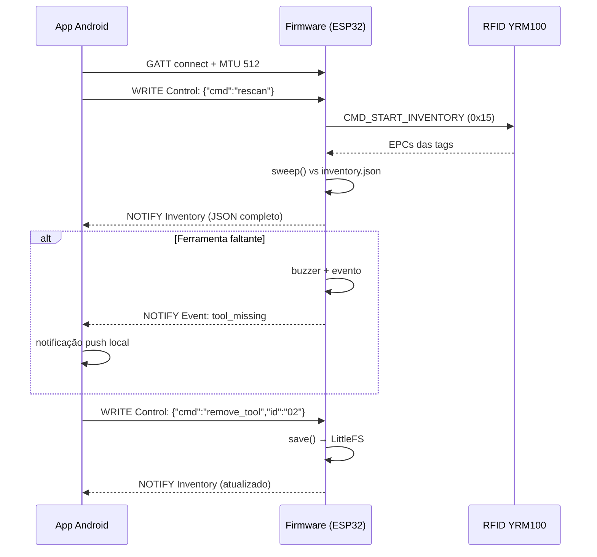

# 📡 Protocolo BLE / GATT do Trakr

Este documento é a **fonte da verdade** do protocolo de comunicação entre a maleta (firmware ESP32) e o app Android. Todo código deve seguir este documento:

* Firmware: `firmware/include/ble_profile.h`
* App: `app/src/main/kotlin/app/trakr/core/ble/BleProfile.kt`

> ⚠️ Se alterar qualquer UUID ou formato de payload, **atualize os três** (este documento, `ble_profile.h` e `BleProfile.kt`) no mesmo commit.

## Dispositivo

| Propriedade | Valor |
| --- | --- |
| Nome (advertisement) | `TRAKR-MALETA` |
| MTU | 512 bytes (negociado) |
| Intervalo de conexão | 24–48 slots (60s supervisor) |

## Serviço

| Campo | Valor |
| --- | --- |
| UUID do serviço | `60c1f000-1b2e-4d0f-9aeb-0fbe3c2a4b71` |

## Características

| UUID | Nome | Propriedades | Descrição |
| --- | --- | --- | --- |
| `60c1f001-...` | **Inventory** | READ + NOTIFY | Inventário completo em JSON (formato idêntico ao `inventory.json`). |
| `60c1f002-...` | **Event** | READ + NOTIFY | Eventos assíncronos (ex: ferramenta faltando) em JSON. |
| `60c1f003-...` | **Control** | WRITE | Comandos do app para o firmware (JSON). |

> **Fluxo de sincronização:** no `onServicesDiscovered`, o app assina as notificações de *Inventory* e *Event* e envia `{"cmd":"rescan"}` no *Control*; o firmware responde notificando o inventário completo.

## Payloads

### Inventário (notify/read)

```json
{
  "toolbox": "Trakr",
  "tools": [
    { "id": "01", "name": "Chave de Fenda Cross", "tag": "E28011606000020400000001", "present": true }
  ]
}
```

### Evento de ferramenta ausente (notify)

```json
{ "type": "tool_missing", "tool_id": "01", "name": "Chave de Fenda Cross" }
```

### Comandos do app (control — WRITE)

| Comando | Payload | Efeito no firmware |
| --- | --- | --- |
| Varrer novamente | `{"cmd":"rescan"}` | Executa `LEITURA` (sweep UHF + publish). |
| Adicionar ferramenta | `{"cmd":"add_tool","name":"...","tag":"E2..."}` | Adiciona ao inventário local e salva em LittleFS; re-notifica inventário. |
| Remover ferramenta | `{"cmd":"remove_tool","id":"01"}` | Remove do inventário local e salva em LittleFS; re-notifica inventário. |

> **Ressalva:** os comandos `add_tool`/`remove_tool` são processados pelo firmware: adicionam/removem no `inventory.json` (LittleFS) e re-notificam o inventário completo. Enquanto desconectada, o app grava localmente (fallback offline, a maleta segue como fonte da verdade).

## Diagrama de sequência



## Validação rápida (monitor serial)

O firmware loga no serial (`115200 baud`) a cada varrimento, incluindo o JSON do inventário publicado via GATT:

```
[TRAKR] Inventario carregado: 6 ferramentas
[TRAKR] Boot | wake cause: 3
[TRAKR] BLE iniciado com GATT pronto
[TRAKR] !!! Ferramenta ausente: Chave de Fenda Cross