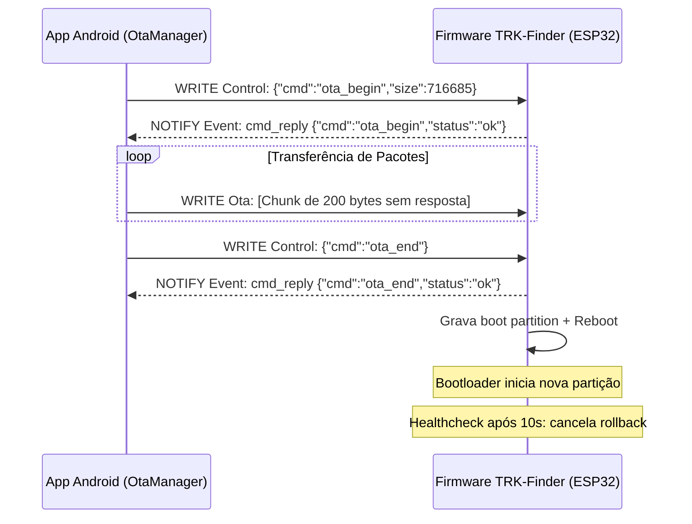

# 📡 Protocolo BLE / GATT do Trakr

Este documento é a **fonte da verdade** do protocolo de comunicação entre o **TRK-Finder** (firmware ESP32) e o app Android. Todo código deve seguir este documento:

* Firmware: `firmware/include/ble_profile.h`
* App: `app/src/main/kotlin/app/trakr/core/ble/BleProfile.kt`

> ⚠️ Se alterar qualquer UUID ou formato de payload, **atualize os três** (este documento, `ble_profile.h` e `BleProfile.kt`) no mesmo commit.

## Dispositivo

| Propriedade | Valor |
| --- | --- |
| Nome (advertisement) | `TRK-FINDER` |
| Filtro de scan do app | prefixo `TRK-` |
| MTU | 512 bytes (negociado) |
| Intervalo de conexão | 24–48 slots (60s supervisor) |

> O app conecta-se a todos os rastreadores TRK-Finder encontrados na proximidade (multi-device).

## Serviço

| Campo | Valor |
| --- | --- |
| UUID do serviço | `60c1f000-1b2e-4d0f-9aeb-0fbe3c2a4b71` |

## Características

| UUID | Nome | Propriedades | Descrição |
| --- | --- | --- | --- |
| `60c1f001-...` | **Inventory** | READ + NOTIFY | Inventário em JSON (formato idêntico ao `inventory.json` no LittleFS). |
| `60c1f002-...` | **Event** | READ + NOTIFY | Notificação assíncrona de eventos, relatórios de radar, telemetria de sensores e ACKs (`cmd_reply`). |
| `60c1f003-...` | **Control** | WRITE | Envio de comandos do app para o firmware em JSON. |
| `60c1f004-...` | **History** | READ | Histórico recente de eventos persistidos (array JSON em RAM/LittleFS). |
| `60c1f005-...` | **Ota** | WRITE | Stream binário bruto de firmware (chunks de até 200 bytes, `WRITE_TYPE_NO_RESPONSE`). |

> **Fluxo inicial de sincronização:** ao conectar e disparar `onServicesDiscovered`, o app assina as notificações de *Inventory* e *Event*, lê o *History*, sincroniza o relógio via `set_clock` e solicita as configurações via `get_config`.

---

## Payloads de Dados

### 1. Inventário (notify/read — Inventory)

```json
{
  "tools": [
    { "id": "01", "name": "Chave de Fenda Cross", "tag": "E28011606000020400000001", "present": true },
    { "id": "02", "name": "Alicate Universal 8\"", "tag": "E28011606000020400000002", "present": false }
  ]
}
```

* `id`: Identificador incremental local atribuído pelo firmware.
* `name`: Nome legível da ferramenta.
* `tag`: Código EPC da tag UHF RFID (geralmente 24 caracteres hexadecimais).
* `present`: `true` se detectada na última varredura UHF, `false` se ausente.

### 2. Histórico de Eventos (read — History)

```json
[
  { "ts": 1723780800000, "type": "boot", "tool_id": "", "name": "" },
  { "ts": 1723780860000, "type": "missing", "tool_id": "02", "name": "Alicate Universal 8\"" }
]
```

* `ts`: Timestamp em milissegundos UTC absoluto (se sincronizado via `set_clock`) ou relativo ao `millis()` do boot.
* `type`: Tipo do evento (`boot`, `missing`, etc.). Relatórios contínuos (`radar_report`, `live_report`, `cmd_reply`) não são gravados no histórico permanente.

### 3. Relatório do Modo Radar Single Tag (notify — Event)

Publicado periodicamente a cada ciclo (~400 ms) quando no estado `RASTREIA`:

```json
{ "type": "radar_report", "tag": "E28011606000020400000001", "rssi": -52, "present": true, "delta": 3, "hint": "continue" }
```

* `tag`: EPC da ferramenta procurada.
* `rssi`: Potência do sinal recebido em dBm com calibração aplicada (`rssi_offset`).
* `present`: `true` se detectada no ciclo atual (`rssi: -100` quando ausente).
* `delta`: Variação de RSSI em relação à leitura anterior (positivo = aproximando, negativo = afastando).
* `hint`: Sugestão de navegação direcional (`continue`, `turn_around`, `hold`, `search`).

### 4. Relatório do Modo Radar Multi-Alvo (notify — Event)

Publicado no estado `MULTI` quando rastreando múltiplas tags simultaneamente:

```json
{
  "type": "radar_multi_report",
  "targets": [
    { "tag": "E28011606000020400000001", "rssi": -48, "present": true },
    { "tag": "E28011606000020400000002", "rssi": -65, "present": true },
    { "tag": "E28011606000020400000003", "rssi": -100, "present": false }
  ]
}
```

* Os alvos são ordenados decrescentemente por potência de sinal (a ferramenta mais próxima encabeça a lista).

### 5. Relatório de Varredura ao Vivo / Live Stream (notify — Event)

Publicado continuamente (~500 ms) no estado `LIVE` reportando tudo que o leitor UHF enxerga:

```json
{
  "type": "live_report",
  "reads": [
    { "tag": "E28011606000020400000001", "rssi": -55 },
    { "tag": "E28011606000020400000004", "rssi": -72 }
  ]
}
```

---

## 🛠️ Comandos do App (Control — WRITE)

Todos os comandos são enviados em formato JSON para a característica **Control**. O firmware sempre responde com uma notificação `cmd_reply` na característica **Event**.

| Comando | Payload de Exemplo | Descrição e Efeito no Firmware |
| --- | --- | --- |
| **Versão** | `{"cmd":"get_version"}` | Retorna `fw_version` e `git_commit` do dispositivo. |
| **Ler Configurações** | `{"cmd":"get_config"}` | Retorna timeouts, calibração RF, flags de PIN, status de autenticação e expiração de sessão. |
| **Alterar Configurações** | `{"cmd":"set_config","listen_ms":30000,"tx_power_dbm":26,"rssi_offset":0,"rssi_threshold":-70,"beep":true}` | Ajusta parâmetros parciais e persiste em `/config.json`. |
| **Autenticar PIN** | `{"cmd":"auth","pin":"1234"}` | Valida SHA-256 do PIN. Abre sessão autenticada de 5 minutos com proteção contra brute-force (lockout). |
| **Sincronizar Relógio** | `{"cmd":"set_clock","epoch_ms":1723780800000}` | Define epoch UTC atual; calcula e persiste delta para carimbo de tempo em eventos. |
| **Reescanear Inventário** | `{"cmd":"rescan"}` | Dispara varredura imediata UHF (`LEITURA`) e notifica inventário atualizado. |
| **Sincronizar Inventário** | `{"cmd":"sync_inventory","tools":[{"name":"Chave","epc":"E2..."}]}` | Grava e substitui o inventário completo em lote no LittleFS. |
| **Iniciar Radar (Single)** | `{"cmd":"start_radar","tag":"E2801160..."}` ou `{"cmd":"start_radar","id":"01"}` | Entra em `RASTREIA`, emitindo bipes e transmitindo `radar_report`. |
| **Parar Radar** | `{"cmd":"stop_radar"}` | Interrompe o radar e retorna ao estado `SINCRONIZA`. |
| **Iniciar Radar Multi** | `{"cmd":"start_radar_multi","tags":["E2...","E2..."]}` | Entra em `MULTI`, rastreando várias tags simultaneamente com ranking de sinal. |
| **Iniciar Varredura Live** | `{"cmd":"start_live","interval_ms":500}` | Entra em `LIVE`, transmitindo stream contínuo `live_report`. |
| **Parar Varredura Live** | `{"cmd":"stop_live"}` | Retorna ao estado `SINCRONIZA`. |
| **Capturar Tag Próxima** | `{"cmd":"capture_tag"}` ou `{"cmd":"scan_one"}` | Varre o ambiente e retorna a tag de maior RSSI para cadastro rápido no app. |
| **Gravar Tag EPC** | `{"cmd":"write_epc","new_epc":"E28011606000020400000099"}` | Grava um novo EPC de 24 hexadecimais na tag via YRM100 (requer autenticação). |
| **Localizar Rastreador** | `{"cmd":"find_device","duration_sec":5}` ou `{"cmd":"locate_finder"}` | Modo "Find My Finder": aciona LED e buzzer pulsando no TRK-Finder por N segundos. |
| **Ajustar Potência RF** | `{"cmd":"set_tx_power","dbm":26}` ou `{"cmd":"set_rf_power","dbm":20}` | Configura a potência de emissão RF do módulo UHF YRM100 (0 a 33 dBm). |
| **Consultar Sensores** | `{"cmd":"get_sensors"}` | Retorna telemetria em tempo real (bateria %, tensão V, temperatura °C, umidade %, pressão hPa, aceleração IMU). |
| **Consultar Add-ons** | `{"cmd":"get_addons"}` | Retorna lista de módulos opcionais conectados (`oled`, `ina219`, `bme280`, `mpu6050`, `vib`, `btn2`). |
| **Ler Histórico Paginado** | `{"cmd":"get_history","limit":50,"offset":0,"month":"202608"}` | Retorna fatia de eventos recentes ou de arquivos mensais arquivados. |
| **Listar Arquivos Histórico** | `{"cmd":"list_archives"}` | Retorna a lista de meses com histórico arquivado em Flash (`/events_YYYYMM.json`). |
| **Logs de Caixa Preta** | `{"cmd":"get_blackbox_logs"}` | Retorna os registros brutos de auditoria offline gravados na Flash. |
| **Cadastrar Ferramenta** | `{"cmd":"add_tool","name":"Martelo","tag":"E280..."}` | Salva ferramenta no LittleFS e re-publica o inventário (requer auth se PIN ativo). |
| **Remover Ferramenta** | `{"cmd":"remove_tool","epc":"E280..."}` ou `{"cmd":"remove_tool","id":"01"}` | Remove ferramenta do LittleFS e re-publica o inventário (requer auth se PIN ativo). |
| **Iniciar OTA** | `{"cmd":"ota_begin","size":716685}` | Prepara partição de atualização OTA para stream de dados binários. |
| **Finalizar OTA** | `{"cmd":"ota_end"}` | Valida integridade do firmware, ajusta partição de boot e reinicia o ESP32. |
| **Abortar OTA** | `{"cmd":"ota_abort"}` | Cancela sessão de atualização e restaura estado operacional. |

---

## 📬 Confirmações e Respostas de Comandos (ACK / cmd_reply)

Todo comando enviado ao **Control** gera um notify com o tipo `cmd_reply` na característica **Event**:

```json
{ "type": "cmd_reply", "cmd": "start_radar", "status": "ok" }
{ "type": "cmd_reply", "cmd": "add_tool", "status": "error", "reason": "duplicate_epc" }
{ "type": "cmd_reply", "cmd": "auth", "status": "error", "reason": "locked", "retry_after_ms": 30000 }
```

### Principais Códigos de Erro (`reason`):
- `invalid_json`: Payload malformado.
- `unknown_cmd`: Comando não reconhecido.
- `missing_fields`: Parâmetros obrigatórios ausentes.
- `invalid_value`: Parâmetro fora da faixa permitida.
- `auth_required`: Ação requer autenticação por PIN prévia.
- `auth_failed`: PIN incorreto.
- `locked`: Temporariamente bloqueado por excesso de tentativas inválidas de PIN.
- `duplicate_epc`: EPC já cadastrado no inventário.
- `tool_not_found`: ID ou EPC não encontrado.
- `invalid_epc`: Código EPC inválido (deve ter exatamente 24 caracteres hexadecimais).
- `no_tag_found`: Nenhuma tag detectada no raio durante `capture_tag`.
- `write_failed`: Módulo UHF não respondeu com confirmação de gravação na tag.
- `save_failed`: Erro de I/O na memória Flash (LittleFS).

---

## ⚡ Telemetria de Sensores e Hardware (`get_sensors` & `get_addons`)

### Resposta de `get_sensors`:
```json
{
  "type": "cmd_reply",
  "cmd": "get_sensors",
  "status": "ok",
  "has_oled": true,
  "has_ina219": true,
  "has_bme280": true,
  "has_mpu": true,
  "has_vib": true,
  "has_btn2": false,
  "tx_power_dbm": 26,
  "rssi_offset": 0,
  "rssi_threshold": -70,
  "env": "default",
  "batt_v": 3.92,
  "batt_pct": 84,
  "batt_valid": true,
  "temp_c": 24.5,
  "hum_pct": 58.0,
  "press_hpa": 1013.2,
  "moving": false,
  "ax": 0.02,
  "ay": -0.01,
  "az": 0.99
}
```

### Resposta de `get_addons`:
```json
{
  "type": "cmd_reply",
  "cmd": "get_addons",
  "status": "ok",
  "addons": ["oled", "ina219", "bme280", "mpu6050", "vib"]
}
```

---

## 🔄 Fluxo de Atualização OTA via BLE

O upload de novos binários de firmware é executado diretamente via BLE com validação em duas etapas e healthcheck no boot:



---

## 🔍 Validação Rápida via Monitor Serial

O firmware do TRK-Finder transmite logs de diagnóstico em tempo real via porta serial (`115200 baud`):

```
[TRAKR] Boot | wake cause: 0
[TRAKR] Inventario carregado: 6 ferramentas
[TRAKR] Historico carregado: 1 eventos
[TRAKR] BLE iniciado com GATT pronto
[TRAKR] Evento: {"ts":1723780800000,"type":"boot"}
[TRAKR] Radar: E28011606000020400000001 (-52dBm)
[TRAKR] BME: 24.5C 58% 1013hPa
```